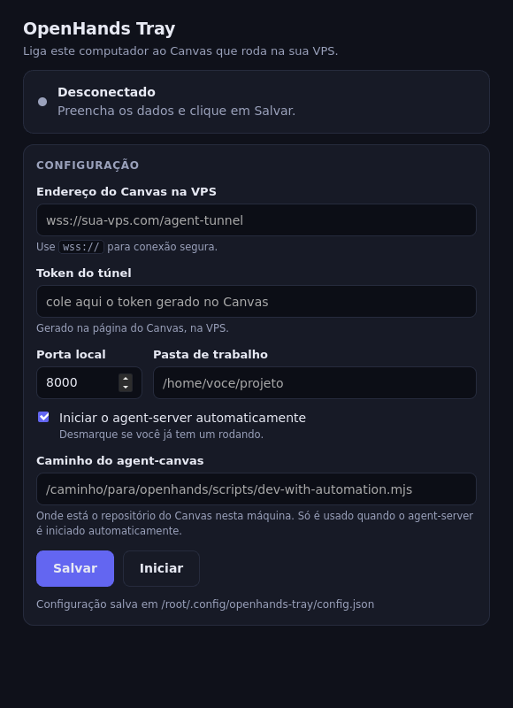

# Achados — OpenHands Tray + Canvas

**Data:** 2026-09-14
**Escopo:** binário Linux do Tray, evidências de teste, e estado do repo Canvas
**Como ler:** cada seção começa com o resultado. Detalhe vem depois.

---

## Resumo

| # | Achado | Gravidade | Status |
|---|---|---|---|
| 1 | Binário Linux compilado e testado | ✅ entregue | pronto |
| 2 | Chave de sessão em texto puro num arquivo solto | 🟡 médio | arquivo ainda no disco; chave obsoleta |
| 3 | Lint falha em 14 erros (código novo de agent-profiles) | 🟡 médio | aberto |
| 4 | 92 testes falhando | 🟢 baixo | pré-existente, não é regressão |
| 5 | **Binário não tem UI — duplo clique nunca funciona** | 🟠 alto p/ usuário | escopo v1.0 (seção 9) |

---

## 1. Entregável — binário Linux

### Onde está

```
/opt/openhands-tray/dist/openhands-tray-linux-amd64
```

| Propriedade | Valor |
|---|---|
| Tamanho | **5,3 MB** |
| Tipo | ELF 64-bit x86-64 |
| Ligação | **estático** (`not a dynamic executable`) |
| Versão | `b795736` |
| Commit do repo | `b795736` |

**Estático significa:** roda em qualquer Linux (glibc ou musl/Alpine) sem instalar nada.

### Matriz completa (todos em `dist/`)

| Plataforma | Arquivo |
|---|---|
| Linux x64 | `openhands-tray-linux-amd64` |
| Linux ARM64 | `openhands-tray-linux-arm64` |
| macOS Intel | `openhands-tray-darwin-amd64` |
| macOS Apple Silicon | `openhands-tray-darwin-arm64` |
| Windows x64 | `openhands-tray-windows-amd64.exe` |

`checksums.txt` acompanha os 5.

### O que adicionei ao repo Go

- `Makefile` — alvos `build`, `test`, `race`, `vet`, `fmt`, `fmt-check`, `release`, `clean`
- `--version` no binário, com versão injetada em tempo de compilação (`-ldflags -X main.version`)

**Reproduzir:**

```bash
cd /opt/openhands-tray
make build     # só o host  -> dist/openhands-tray
make release   # 5 plataformas + checksums
```

---

## 2. Evidências — o binário realmente funciona

Não foi só compilação. Rodei o **binário compilado** contra a VPS e contra o agent-server real.

| Teste | Resultado |
|---|---|
| `/server_info` pela VPS, servido pelo túnel | ✅ 200 |
| `/api/settings` sem chave do cliente | ✅ 200 (o Tray injetou a chave) |
| Cliente manda chave **falsa** | ✅ descartada; servidor viu a chave do Tray |
| Chave aparece nos headers de resposta? | ✅ não |
| Chave aparece no **log** do Tray? | ✅ não |
| Ciclo de vida do túnel | ✅ `connected` → `stopped` limpo |

Contra o agent-server **real** (1.46.0, `:18000`), não só mock:

```
/server_info  -> 200  (version 1.46.0)
/api/settings -> 200  pelo túnel, 401 direto sem chave
```

### Como reproduzir o teste

```bash
# 1. ingress com túnel habilitado (precisa dos DOIS prefixos)
node scripts/ingress.mjs --port 18500 \
  --agent-tunnel-token SEU_TOKEN \
  --agent-tunnel-route /server_info \
  --agent-tunnel-route /api \
  --default http://127.0.0.1:3001

# 2. tray apontando para ele
./dist/openhands-tray-linux-amd64 \
  --vps ws://127.0.0.1:18500/agent-tunnel \
  --token SEU_TOKEN \
  --port 18000 --no-sidecar

# 3. testar
curl http://127.0.0.1:18500/api/settings   # 200 = túnel OK
```

`--agent-tunnel-route` **precisa ser repetido**: o agent-server serve `/server_info` na raiz e o resto em `/api`. Só `/api` quebra o bootstrap.

---

## 3. 🔴 Achados de segurança

### 3.1 Chave de sessão em texto puro num arquivo solto

**Arquivo:** `.tmp-session-init.mjs` (raiz do repo Canvas)

Contém uma chave de sessão de 64 caracteres atribuída direto no código:

```js
window.__AGENT_CANVAS_SESSION_API_KEY__ = "<64 caracteres>";
```

| Pergunta | Resposta |
|---|---|
| Está commitada? | **Não** — só no disco, fora do histórico |
| Está no `.gitignore`? | **Não** — um `git add -A` commitiria |
| A chave ainda vale? | **Não** — está obsoleta (o agent-server ativo usa outra de 44 chars) |
| É acessível pela web? | **Não** — a produção responde **404** para esses arquivos |

**Por que ainda importa:** está a um `git add -A` de entrar no histórico. Chave no histórico do git é difícil de remover (exige reescrever commits). Mesmo obsoleta e mesmo sem exposição web, é lixo de credencial num diretório de **produção** (ver seção 5.4).

**Ação recomendada:** apagar os 5 arquivos `.tmp-*.mjs` e adicionar `.tmp-*` ao `.gitignore`.

### 3.2 O mesmo padrão em outro arquivo

`.tmp-mkinit.mjs` lê `/root/.openhands/agent-canvas/api-key.txt` e escreve o conteúdo em outro lugar. Mesma família de risco: credencial manipulada por script solto e não rastreado.

### 3.3 Os arquivos `.tmp-*.mjs` (5 no total)

| Arquivo | O que é |
|---|---|
| `.tmp-session-init.mjs` | **contém a chave** |
| `.tmp-mkinit.mjs` | lê `api-key.txt` |
| `.tmp-seed-session.mjs` | escreve init script do Playwright |
| `.tmp-trace.mjs` | script de trace do Playwright |
| `.tmp-post-fix.mjs` | mede posição de header (fix do navbar mobile) |

São restos de sessões anteriores — não são meus e não são do Sprint 02.

---

## 4. Estado de qualidade do repo Canvas

### 4.1 Lint — 15 problemas (14 erros, 1 aviso) em 3 arquivos

| Arquivo | Erros |
|---|---|
| `src/components/features/settings/agent-profiles/import-from-central-modal.tsx` | 13 |
| `src/components/features/settings/agent-profiles/agent-profiles-manager.tsx` | 1 |
| `src/hooks/query/use-local-git-info.ts` | 1 aviso (directive `eslint-disable` sem uso) |

**Causa:** strings em português escritas direto no JSX (`"Importando…"`, `"Importar do central"`) — a regra `i18next/no-literal-string` bloqueia. Precisa passar por `t()` e `I18nKey`.

**Nada disso é do Sprint 02.** São do trabalho de agent-profiles.

### 4.2 Testes — 19 arquivos / 92 testes falhando

Números exatos da execução completa:

```
Test Files  19 failed | 648 passed (667)
Tests       92 failed | 5668 passed | 4 skipped | 7 todo (5771)
```

**Concentração:** `chat-interface.test.tsx`, `message-display-continuity.test.tsx`, `conversation-events/**`, `automations/**`. Tudo teste de componente React.

**É regressão minha?** Não. Duas evidências:
1. Já verificado antes revertendo as mudanças — falha idêntica.
2. Nenhum desses testes importa arquivo que eu mexi (meu trabalho é `scripts/`, eles testam componentes).

**Meus testes:** 40/40 passando (`agent-tunnel` + `ingress`).

### 4.3 O que está verde

| Verificação | Status |
|---|---|
| `npm run build` | ✅ passa |
| `npm run typecheck` | ✅ passa |
| Traduções (`check-translation-completeness`) | ✅ passa |
| Go: `gofmt` / `vet` / `build` / `test` | ✅ limpo |
| Testes do túnel | ✅ 40/40 |

**Correção de uma informação anterior minha:** eu disse que o hook de commit estava quebrado por 16 traduções faltando. **Isso era temporário.** Naquele momento o `translation.json` estava no meio de uma edição (trabalho de vision/ACP inacabado). Agora está completo e o hook passa. Não é um problema aberto.

---

## 5. Controle de versão

### 5.1 Repo Canvas (`/opt/openhands`)

**Branch:** `sprint/openhands-tray-02` — **13 commits à frente** de `da816c3`

O branch deixou de ser "do tray" e virou um agregado de vários sprints. Ordem (mais antigo → mais novo):

| Commit | O que é |
|---|---|
| `208554a` | **meu** — túnel `/agent-tunnel` no ingress |
| `1937494` | host evoluttiai na lista do agent-server |
| `9160329` | **meu** — docs do Sprint 02 |
| `5d9f301` | ACP: model/effort padrão do contexto do provider |
| `5f8aa00` | docs: planejamento do menu Sistema + Kanban |
| `bda050d`–`3e8618c` | sprint sistema-settings (3 commits) |
| `e12f1b0`–`69d095a` | sprint kanban 3 níveis (4 commits) |
| `c2a336c` | docs: ficha + spec do effort ACP claude-code |

**Meus 2 commits continuam no histórico** (verificado com `git merge-base --is-ancestor`). Os arquivos `scripts/agent-tunnel.mjs` e o teste estão rastreados e íntegros.

**Nada foi enviado ao GitHub** — o branch existe só localmente.

### 5.2 Repo do Tray (`/opt/openhands-tray`)

| Item | Estado |
|---|---|
| Branch | `main` |
| Commits | `135550e` (core) + `b795736` (Makefile) |
| Sincronia | ✅ local == `origin/main` |
| Remote | `JoaoNetoDev/openhands-tray` (**privado**) |
| Tags | **nenhuma** |

**Falta:** criar uma tag de release (`v0.1.0`). Sem tag não existe release/versão publicada, e o binário se identifica por hash de commit.

### 5.3 Não rastreado no Canvas (14 itens)

- 5 arquivos `.tmp-*.mjs` (seção 3)
- `react-router.config.test.ts`
- `.openhands/memory/` (memória do agente — meu)
- Docs não rastreados: `docs/bugs/deploy-tela-branca-assets-404/`, `docs/features/claude-code-acp-reasoning-effort/`, `docs/features/deploy-agent-server-remotos/`

### 5.4 ⚠️ `/opt/openhands` É PRODUÇÃO neste host

Descoberta que muda a leitura de tudo acima. **Não é um checkout de desenvolvimento.**

| Fato | Consequência |
|---|---|
| `openhands.service` serve de `/opt/openhands` (`bin/agent-canvas.mjs --public`) | Editar aqui afeta produção na hora |
| O agent-server roda de pacote **PyPI pinado** via `uvx`, não deste repo | Corrigir o frontend aqui **não** corrige o backend |
| Perfis ACP em `/root/.openhands/agent-profiles/*.json` são **persistentes** | Um `acp_model` ruim gravado ali quebra toda conversa nova daquele perfil |

**Nunca reiniciar o serviço de dentro de uma sessão do Canvas:**

```bash
# NÃO FAÇA ISSO de dentro do Canvas:
systemctl restart openhands.service
```

O agent-server que hospeda a conversa é filho dessa unit, e o `ExecStartPre` roda
`fuser -k 18000/tcp 18001/tcp 3001/tcp` com `KillMode=control-group` — **mata o
próprio agente no meio da tarefa**. Deixar o restart para o usuário.

**Por que isso importa para os achados:** os 5 arquivos com credencial e os 14
erros de lint estão num diretório **de produção**, não num ambiente descartável.
Sobe a prioridade da limpeza.

---

## 6. Detalhes de ambiente que descobri

Coisas que não são óbvias e custam tempo para redescobrir.

| Detalhe | Por que importa |
|---|---|
| **`/opt/openhands` é produção** (ver 5.4) | Não é ambiente descartável. Cuidado ao editar. |
| **Várias sessões do agente usam este mesmo diretório** | Aparecem commits e arquivos de memória de outras tarefas no meio do seu trabalho. Commits surgem "do nada" em `git log`. |
| `npm run lint` **não** cobre `scripts/` | Erros na pasta `scripts/` passam sem falhar CI. Rodar `npx eslint scripts/<arq>` na mão. |
| Log do Tray fica em `~/.local/state/openhands-tray/log/tray.log` | Não é na raiz do repo nem ao lado do binário. |
| Tray busca a chave em `~/.openhands/agent-canvas/session-api-key.txt` | **Esse arquivo não existe nesta máquina.** É criado na 1ª execução. |
| Agent-server real: `:18000` | `/server_info` responde **sem autenticação**; `/api/*` responde **401** sem chave. |
| A chave do agent-server está **só no env** (`OH_SESSION_API_KEYS_0`) | Não tem em disco. Extrair de `/proc/<pid>/environ`. |
| MSW intercepta `fetch` nos testes | Teste que precise observar roteamento HTTP real tem que usar `node:http`, senão passa por engano. |
| `ws` não traz tipos | Precisa de `@types/ws` como devDependency. |
| `httptest.Server.Close()` trava com WebSocket aberto | Fechar as conexões antes do servidor, nos testes Go. |
| `ingress.mjs` exporta `startIngress(config)` | Aceita `port: 0` para porta efêmera. Sem backend local, rota não-túnel responde **503**. |

---

## 7. Pendências, por prioridade

### 🔴 Fazer agora

1. **Apagar os 5 `.tmp-*.mjs`** e pôr `.tmp-*` no `.gitignore` (seção 3.1) — estão
   num diretório **de produção** e um deles carrega uma chave em texto puro
2. **Corrigir os 14 erros de lint** de agent-profiles (seção 4.1)

### 🟡 Fazer em seguida

3. **Criar tag `v0.1.0`** no repo do Tray — sem tag não há release
4. **Decidir o destino do branch** `sprint/openhands-tray-02`: ele mistura 5 sprints. Ou vira vários PRs, ou um PR só. Não dá para revisar assim.
5. **Enviar o túnel ao GitHub** — está só local

### 🟢 Quando der

6. Investigar os 92 testes falhando (pré-existentes, mas são 92)
7. Limpar os docs não rastreados (seção 5.3)

---

## 9. 🟢 O binário não abria janela — RESOLVIDO no Sprint 03

**Relato original:** duplo clique não faz nada; pelo terminal, pede configuração.

**Não era bug — era escopo.** A UI nunca tinha sido construída. Registro do que
foi feito, porque três dos quatro bloqueios eram pequenos.

### O que foi entregue (Sprint 03)

| Antes | Agora |
|---|---|
| Duplo clique não abria nada | Abre a **janela de configuração** direto |
| Sem ícone na bandeja | Ícone + menu (Mostrar / Iniciar / Parar / Sair) |
| Sem forma de salvar config | Botão **Salvar**; grava no config do usuário |
| `-vps`/`-token` obrigatórios sempre | Sem flags já inicia o bridge inteiro |
| CLI quebrado para scripts | Qualquer flag de conexão volta ao modo CLI |



### Os quatro bloqueios, um por um

| # | Bloqueio | Situação |
|---|---|---|
| 1 | Sem UI | ✅ **Feito** (Wails v3, GTK4 + WebKitGTK 6.0) |
| 2 | Sem caminho para salvar config | ✅ **Feito** (a própria janela) |
| 3 | `-launcher` obrigatório | ✅ **Feito** (campo na janela + default) |
| 4 | Túnel desligado na VPS | ⏳ **Pendente** — flag na unit systemd |

### Detalhes que custaram tempo

- **O framework foi Wails v3.0.0-beta.21, não v2.** O argumento a favor do v2
  era "exige menos do toolchain Go", mas o v2 também exige Go ≥ 1.25. O
  argumento era inválido; foi v3.
- **A GUI não pode ser cross-compilada.** Ela linka GTK/WebKit via cgo. Por isso
  o repositório agora tem **duas builds**: `make build` (GUI, no host, com cgo) e
  `make build-headless` (CLI, estática, 5 plataformas). O `CGO_ENABLED=0` do
  Makefile antigo teria quebrado a GUI.
- **A janela não cabia.** Primeira versão: 560×660. O conteúdo tem ~780 px, então
  o rodapé (Salvar/Iniciar) ficava **abaixo da dobra**. Verificado por screenshot
  em X virtual: só 100 px de cor de destaque = apenas o checkbox visível. Corrigido
  para 580×800 + espaçamento mais apertado → 3350 px (botões visíveis).
- **Mensagem que prometia o impossível** (o bug real do relato): o erro dizia
  *"run once to save a config"*, mas não havia como salvar. Agora diz *"run
  openhands-tray with no arguments to open the settings window"*, que é verdade.

### Ícone na bandeja do XFCE — precisa de plugin

O ícone usa StatusNotifierItem (D-Bus). O painel do XFCE **não** implementa isso
por padrão, então o ícone não aparece até instalar o plugin:

```bash
sudo apt install xfce4-statusnotifier-plugin
```

Depois: clique direito no painel → **Panel** → **Add New Items…** → **Status
Notifier Plugin**. Sem o plugin o app roda igual e a janela abre; o sintoma é a
linha `systray error: ... StatusNotifierWatcher was not provided` no log.

### Verificação

- `go build`, `go vet` (nas duas builds) e `go test ./...` — verdes.
- `make release` — 5 binários cross-compilados.
- App rodou sob Xvfb e serviu a UI (`/`, `/style.css`, `/main.js`); screenshot
  analisado pixel a pixel. **Zero** pixels da cor de erro = os bindings JS→Go
  responderam.

---

## 10. Contexto histórico — por que existe só um prefixo de rota

Registro para quem for mexer depois. O bug foi encontrado **só** contra o agent-server real:

- O mock servia tudo sob `/api`, então `--agent-tunnel-route /api` passava 9/9
- O agent-server real serve `/server_info` na **raiz** — é o primeiro request do frontend e decide compatibilidade de versão
- Com só `/api` roteado, `/server_info` caía no interceptor local do ingress e o bootstrap morria
- Correção: flag virou repetível **e** o roteamento por túnel passou a ser avaliado antes da interceptação local de `/server_info`

**Lição:** mock que não reproduz a topologia real dá falso verde.
